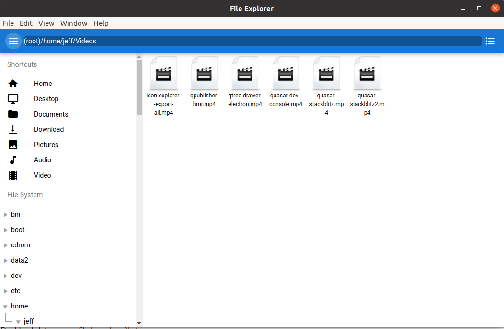

# File Explorer (electron-quasar-file-explorer-v2)

This is a follow-up to an article I wrote and published on [Medium](https://medium.com/quasar-framework/building-an-electron-file-explorer-with-quasar-and-vue-7bf94f1bbf6).

This File Explorer now uses Quasar v2 and Vue 3 composition API.

This is a rudimentary File Explorer that works for Windows, Mac and Linux systems.

Items that have been added since the last tutorial:

- Double-click to open a file based on it's type

Removed since last tutorial:

- File/folder watching (I just never got around to updating this)

There is still plenty of work to be done to make it better.

For example:

- copy, paste, cut, delete
- file info
- plug and play drives (ie: USBs)
- and others

Feel free to PR if you like to make it better for others.

# Donate
If you appreciate the work that went into this, please consider donating to [Quasar](https://donate.quasar.dev) or [Jeff](https://github.com/sponsors/hawkeye64).

# License
MIT (c) Jeff Galbraith <<jeff@quasar.dev>>
