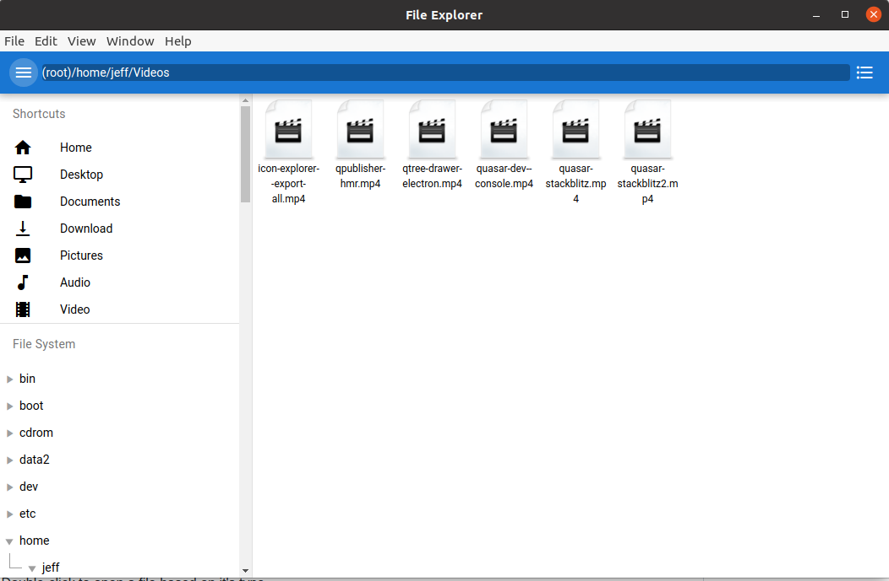

# File Explorer (electron-quasar-file-explorer-v2)



This is a follow-up to an article I wrote and published on [Medium](https://medium.com/quasar-framework/building-an-electron-file-explorer-with-quasar-and-vue-7bf94f1bbf6).

This File Explorer now uses Quasar v2, Vue 3, and the current Quasar app-vite Electron workflow.

This is a rudimentary File Explorer that works for Windows, Mac and Linux systems.

## Current Stack

- App version `3.0.2`
- Quasar `2.19.x`
- `@quasar/app-vite` `3.0.0-beta`
- Vue `3.5.x`
- Electron `42.x`
- Node `24.x`
- pnpm `11.x`

Electron runtime dependencies live in `src-electron/package.json`, while renderer dependencies live in the root `package.json`. This mirrors the current Quasar app-vite Electron setup and keeps packaged Electron dependencies separate from the browser app.

## What This Demonstrates

- Quasar app-vite Electron mode with a separate `src-electron` runtime package.
- Electron main and preload scripts using the current Quasar `#q-app/electron/*` runtime helpers.
- A secure preload bridge with `contextIsolation: true`.
- Electron Builder packaging with app icons under `src-electron/electron-assets/icons`.
- A Node 24 / pnpm 11 verification workflow suitable for CI.

## Install

```bash
pnpm install
pnpm electron:install
```

## Development

```bash
pnpm dev
```

The dev command removes an inherited `ELECTRON_RUN_AS_NODE` environment variable before launching Quasar. If that variable leaks in from a parent shell, Electron starts like plain Node and its main-process APIs are unavailable.

## Verify

```bash
pnpm verify
```

## Build

```bash
pnpm build
```

The build creates the packaged Electron output in `dist/electron`.

Items that have been added since the last tutorial:

- Double-click to open a file based on its type

Removed since last tutorial:

- File/folder watching (I just never got around to updating this)

There is still plenty of work to be done to make it better.

For example:

- copy, paste, cut, delete
- file info
- plug and play drives (ie: USBs)
- and others

Feel free to PR if you would like to make it better for others.

## Sponsor

If Electron Quasar File Explorer is useful in your workflow and you want to support ongoing maintenance:

GitHub Sponsors: https://github.com/sponsors/hawkeye64

PayPal: https://paypal.me/hawkeye64

## License

MIT (c) Jeff Galbraith <<galbraith64@gmail.com>>
